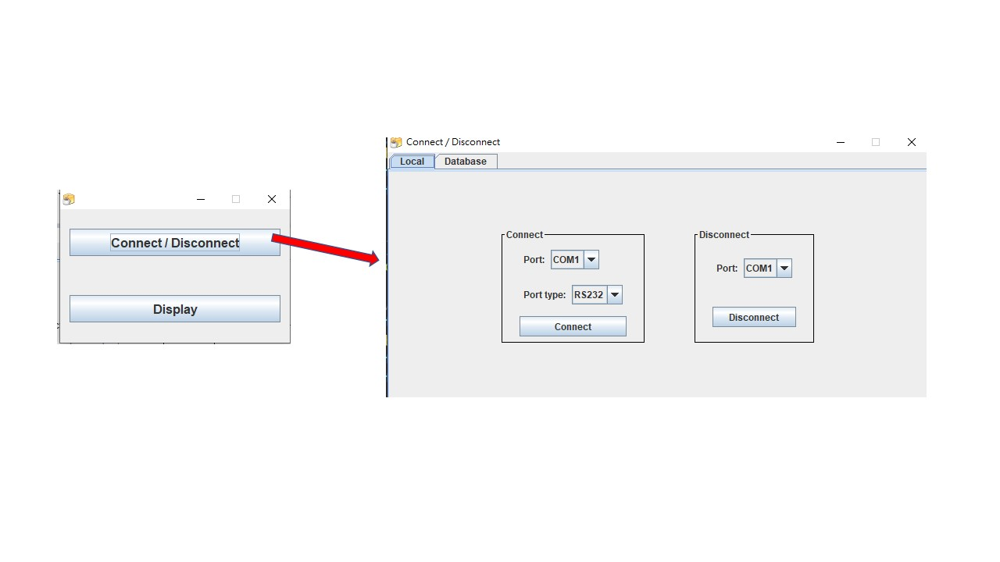
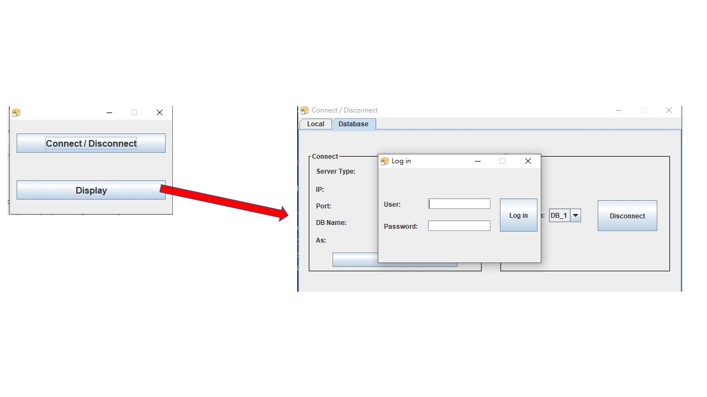

電磁場即時偵測及紀錄系統
===============================================================

硬體設備 : TES-1394 電磁波測試計
資料庫 : SQL Server
開發環境 : Java SE 8
Referenced Libraries : RXTX

---------

執行HomeUI.class(bin/UI/HomeUI.class)

1.建立連線
-----------
建立本地接口連線:

建立資料庫連線:

-----------------
